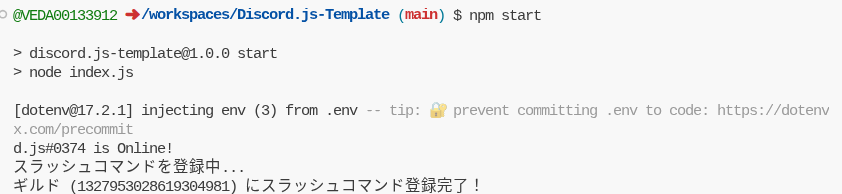
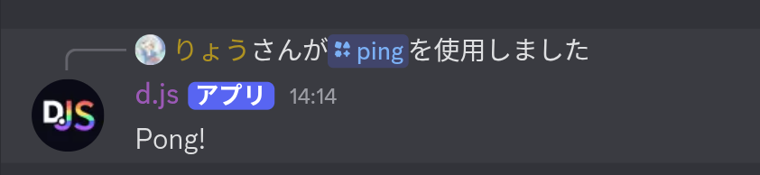

# Discord.js-Template
このリポジトリは **Discord.js v14**を使った BOT 開発のテンプレートです  
スラッシュコマンドやイベント管理、起動時のコマンド自動登録機能を入れています
## ディレクトリ構成
```
my-discord-bot/
├─ commands/ # スラッシュコマンド
│ └─ ping.js
├─ events/ # イベントハンドラ
│ ├─ ready.js
│ └─ interactionCreate.js
├─ config/ # 環境変数読み込み
│ └─ config.js
├─ deploy-commands.js # スラッシュコマンド登録処理
├─ index.js # メインファイル
├─ .env # トークンやIDを管理
├─ package.json
└─ node_modules/
```

## .env 設定例
BOTの起動をするために.envを作成し、設定を行います。TOKENや各IDの取得方法は調べてください  
GUILD_IDは設定していなければグローバルコマンド(どこでも使える)、設定していればギルドコマンド(その鯖でのみ有効)になるようにしています。  
```
TOKEN=YOUR_BOT_TOKEN
CLIENT_ID=YOUR_CLIENT_ID
GUILD_ID= # 開発用ならギルドID、本番は空でもOK
```

## インストール

```bash
git clone https://github.com/VEDA00133912/Discord.js-Template
cd my-discord-bot
npm install
```
## 起動
インストール作業、envの作成と設定が完了したらBOTが起動できる状態になります。  
```bash
npm start
```
で起動してください。  
こうなれば成功です↓  
  
  
コマンド実行するとこんな感じ  

## コマンドの追加
commandsフォルダに新しくコマンドファイルを作成してください。SlashCommandBuilderで定義するように。  
後はBOTを再起動させれば自動で追加されます

## 公式リンク
英語ですが、公式ドキュメントです。これ読みながらやれば結構楽です  
[Discord.js公式ドキュメント](https://discordjs.guide/)  
[docs](https://discordjs.guide/)